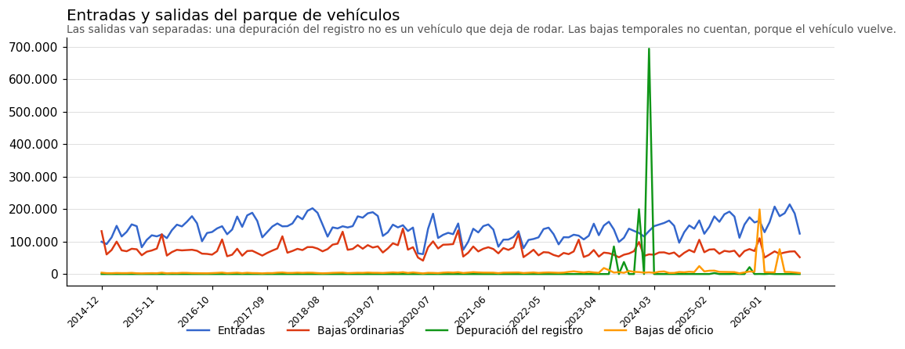
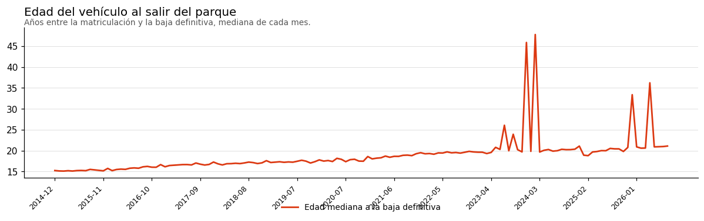
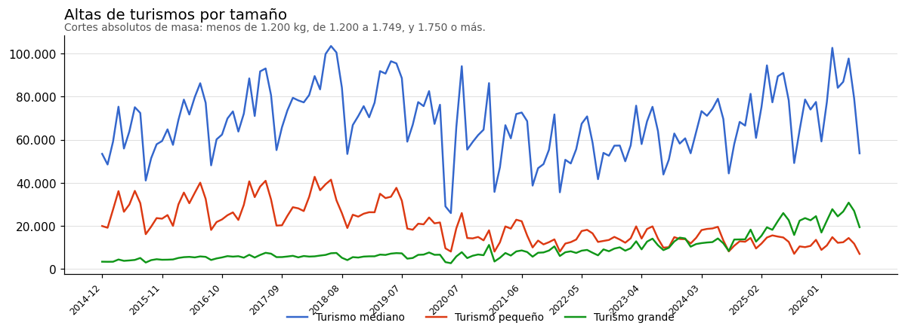
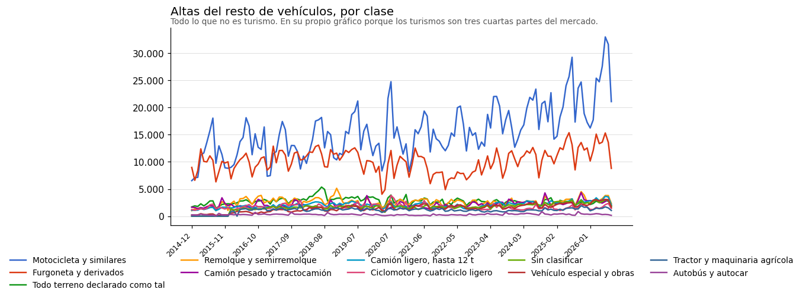
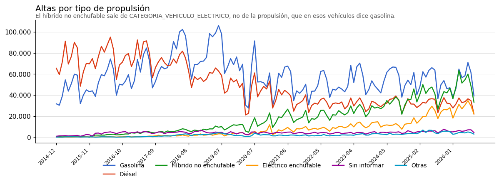

<!--
Documento abierto el 2026-09-02, a petición de Víctor: «habría que hacer un nuevo .md con algunas estadísticas y gráficos de series mensuales».
ES DERIVADO: lo generan las consultas de analysis/monthly-series.py contra la base cargada, y las cifras del cuerpo salen de esa ejecución. Si hay que corregir un número, se corrige la consulta y se regenera; no se edita a mano.
Los turismos van en un gráfico aparte porque Víctor lo pidió así y porque son el 70% de las altas: en un eje compartido, todo lo demás es una línea plana.
La advertencia sobre Madrid es la más importante del documento y por eso está arriba y no en una nota al pie: sin ella, cualquiera leería la tabla de provincias como un mapa de consumo, y es un mapa de domiciliación de flotas.
Lo que NO se pone: nada por marca ni por modelo, porque el texto está sucio y no se ha normalizado. Ver el hallazgo 2 de fase0-resultados.md.
-->

# Estadísticas y series mensuales

Lo que dicen los datos cargados, medido el **2026-09-02** sobre **19.599.679 entradas** y **12.389.335 salidas** del parque, de diciembre de 2014 a agosto de 2026. De esas salidas, **1.042.271 no son vehículos que dejaron de rodar sino depuraciones del registro**, y por eso van siempre por separado: [ver más abajo](#la-depuración-de-2024-que-no-es-mercado).

Todo esto se regenera con un comando, así que las cifras y los gráficos no se editan a mano:

```
python3 /home/devel/matveh/analysis/monthly-series.py
```

Los conteos son de las vistas `spain.park_entry` y `spain.park_exit`, o sea que **las bajas temporales no cuentan como salida** —el vehículo vuelve— y **el paso de matrícula temporal a definitiva no cuenta como entrada**, porque es el mismo vehículo que ya contó. De los 19.750.700 registros de alta cargados, 151.021 no son entradas al parque por ese motivo.

## Antes de leer nada: dos avisos

**La geografía es el domicilio del vehículo, no dónde se vendió ni dónde rueda.** Madrid concentra el **31,8 %** de todas las altas de once años, y eso no es consumo madrileño: es dónde tienen su domicilio social las empresas de renting y de alquiler. Cualquier reparto provincial de este documento hay que leerlo así.

**No hay nada por marca ni por modelo, y es deliberado.** Esos campos son texto libre y sucio —1.491 grafías de marca en un solo mes, con el mismo coche escrito de once maneras—, así que un agregado por marca no es publicable hasta que se normalice. Lo que sí es sólido es todo lo que sale de los códigos y de las medidas físicas, que es lo que hay aquí.

## Entradas y salidas del parque



**Las salidas van separadas en tres, y no es un adorno: sumarlas produce un gráfico que miente.** De los 12.389.335 registros de baja definitiva, **1.042.271 —el 8,4 %— no son vehículos que dejaron de rodar, sino asientos administrativos**.

| Año | Entradas | Bajas ordinarias | Depuración del registro | De oficio |
|---|---:|---:|---:|---:|
| 2014 *(sólo diciembre)* | 99.421 | 132.233 | 0 | 4.256 |
| 2015 | 1.445.217 | 932.252 | 0 | 34.584 |
| 2016 | 1.685.210 | 853.753 | 128 | 36.589 |
| 2017 | 1.807.444 | 845.187 | 23 | 40.166 |
| 2018 | 1.936.058 | 994.388 | 25 | 43.879 |
| 2019 | 1.891.278 | 1.043.806 | 7 | 48.836 |
| 2020 | 1.373.847 | 930.193 | 6 | 45.106 |
| 2021 | 1.422.027 | 935.588 | 9 | 52.938 |
| 2022 | 1.367.284 | 795.974 | 7 | 59.194 |
| 2023 | 1.556.699 | 772.103 | **321.779** | 87.515 |
| 2024 | 1.699.418 | 803.335 | **694.304** | 84.978 |
| 2025 | 1.923.845 | 876.719 | 25.184 | **275.790** |
| 2026 *(hasta agosto)* | 1.391.931 | 503.884 | 799 | 113.818 |

**Las bajas ordinarias son notablemente estables**: entre 772.000 y 1.044.000 al año, con una media de 889.000 en 2015-2025. Ésa es la serie que se puede usar para cualquier cosa; las otras dos columnas son actos administrativos y hay que tratarlas como tales.

### Edad del vehículo al salir del parque



Mediana mensual de los años transcurridos entre la matriculación y la baja definitiva. Está calculada con `registration_date`, que viene en el 100 % de los registros, y **no** con `FEC_PRIM_MATRICULACION`, que la DGT rellena sólo en el 4-13 % de los casos y que habría dado una serie construida sobre una decimoparte de los datos.

Es la primera aproximación al ciclo de vida que permite esta fuente, con la limitación de fondo que ya está documentada: **no se puede seguir un vehículo entre ficheros**, porque el bastidor viene truncado, así que esto es una distribución de edades a la baja, no el seguimiento de una cohorte.

### La depuración de 2024, que no es mercado

El pico de **763.000 salidas en febrero de 2024** es una depuración del registro, y se puede demostrar sin salir de los datos:

- El fichero de la DGT de ese mes pesa **52,6 MB con 826.154 registros**, seis veces uno normal, así que el pico está en origen y no en nuestra carga.
- **694.219 de esas bajas llevan el motivo `4`, «Otros motivos»**, cuando en enero del mismo año hubo **cero** de ese motivo y todo lo demás siguió en su nivel habitual: 48.588 voluntarias contra 44.186 el mes anterior, 66.011 temporales contra 67.353.
- Y sobre todo, **la edad de esos vehículos**: 334.397 se matricularon en los años 70 y 130.893 en los 60, con una edad media de **50 años**; hay 130 de la década de 1920 y cinco de 1900. No dejaron de circular en 2024: **dejaron de constar**.

La operación no fue puntual, sino una campaña: 321.779 bajas del mismo motivo en 2023 —repartidas en julio, septiembre y diciembre—, las 694.304 de 2024 y unas pocas más en 2025. Y en **diciembre de 2025** hay otra distinta: **199.177 bajas «de oficio por abandono»** en un mes, contra 7.208 el mes anterior; de ahí que las de oficio de 2025 tripliquen las de cualquier año previo.

**Lo que esto demuestra, y es la conclusión útil**: el registro contaba como vivos casi 700.000 vehículos que llevaban medio siglo parados. Confirma con números lo que [fuente.md](fuente.md#limitaciones-que-condicionan-cualquier-uso) ya advertía —**esto es un fichero de eventos, no un censo del parque**— y quita valor a cualquier «parque circulante» calculado como altas menos bajas: ni la cifra de antes de la depuración ni la de después son el parque real.

### Diciembre, un 60 % por encima, y es fiscal

Medida la estacionalidad de las bajas **ordinarias** entre 2015 y 2025, sin depuraciones ni bajas de oficio, el patrón es inequívoco:

| Mes | Media mensual | Desviación |
|---|---:|---:|
| enero | 60.812 | −17 % |
| febrero | 68.683 | −6 % |
| marzo | 76.329 | +4 % |
| abril | 61.328 | −16 % |
| mayo | 70.736 | −4 % |
| junio | 74.145 | +1 % |
| julio | 73.671 | 0 % |
| agosto | 60.811 | −17 % |
| septiembre | 71.192 | −3 % |
| octubre | 75.551 | +3 % |
| noviembre | 78.394 | +7 % |
| **diciembre** | **117.735** | **+60 %** |

Diciembre es el máximo con diferencia y enero el mínimo, y el salto entre los dos meses consecutivos es de un factor de casi dos. **La interpretación es nuestra, no un dato de la fuente**: el impuesto de vehículos de tracción mecánica se devenga el 1 de enero, así que quien no va a usar el vehículo tiene un mes de plazo para darlo de baja y no pagarlo. Encaja también con el mínimo de abril y agosto, que son los meses en los que nadie hace papeleo.

Para cualquier serie que se publique, esto significa que **las bajas necesitan desestacionalización y las altas otra distinta**, porque sus estacionalidades no tienen el mismo origen.

## Turismos por tamaño: el mercado engorda



Éste es el gráfico que motivaba la clasificación, y es concluyente. Los cortes son **absolutos y de masa** —menos de 1.200 kg, de 1.200 a 1.749, y 1.750 o más— precisamente para que el desplazamiento se vea:

- **El turismo pequeño se hunde**: de 35.000-40.000 altas al mes entre 2015 y 2019, a 10.000-14.000 en 2025 y 2026.
- **El grande se multiplica**: de unas 4.000 al mes en 2015 a 25.000-30.000 hoy.
- **Se cruzan en 2024.** Desde ese año se matriculan más turismos grandes que pequeños en España, algo que no había pasado nunca en la serie.
- El mediano domina siempre y sigue siendo la mitad del mercado.

Para el negocio de los neumáticos, eso es la señal: **la demanda se desplaza de medidas pequeñas a medidas grandes**, y el desplazamiento lleva una década en marcha.

## El resto de vehículos



En su propio gráfico porque los turismos son el 70 % de las altas y en un eje compartido esto sería una línea plana. Lo que destaca: **las motocicletas casi duplican** en la serie —de 10.000-15.000 al mes a más de 30.000 en 2026— y **las furgonetas crecen sostenidamente**, de 7.000-12.000 a 15.000. El resto de clases se mueve en la banda de 0 a 5.000 y conviene mirarlas por separado si alguna interesa.

| Clase | Altas | % |
|---|---:|---:|
| Turismo mediano | 9.588.204 | 48,9 |
| Turismo pequeño | 2.846.443 | 14,5 |
| Motocicleta y similares | 2.198.416 | 11,2 |
| Furgoneta y derivados | 1.426.822 | 7,3 |
| Turismo grande | 1.322.807 | 6,7 |
| Todo terreno declarado como tal | 388.822 | 2,0 |
| Remolque y semirremolque | 369.128 | 1,9 |
| Camión pesado y tractocamión | 294.750 | 1,5 |
| Camión ligero, hasta 12 t | 290.544 | 1,5 |
| Ciclomotor y cuatriciclo ligero | 239.298 | 1,2 |
| Sin clasificar | 232.839 | 1,2 |
| Vehículo especial y obras | 205.471 | 1,0 |
| Tractor y maquinaria agrícola | 152.426 | 0,8 |
| Autobús y autocar | 43.709 | 0,2 |

El **todo terreno son sólo el 2 %**, y eso no significa que se vendan pocos SUV: significa lo que ya avisaba [alcance.md](alcance.md#la-segmentación-por-tamaño-sale-del-propio-registro), que **los SUV se matriculan como turismo** y aquí están contados dentro de los turismos grandes y medianos. El 2 % es sólo lo que la DGT declara explícitamente como todo terreno.

## Propulsión



El híbrido no enchufable no sale del campo de propulsión —que en esos vehículos dice gasolina— sino de `CATEGORIA_VEHICULO_ELECTRICO`, que es donde la DGT lo distingue.

## Las provincias, con el aviso de arriba puesto

| Provincia del domicilio | Altas |
|---|---:|
| Madrid | 6.223.856 |
| Barcelona | 2.180.743 |
| Alicante/Alacant | 923.692 |
| Valencia/València | 870.212 |
| Málaga | 637.725 |
| Balears (Illes) | 544.710 |
| Palmas (Las) | 532.946 |
| Sevilla | 503.043 |
| Murcia | 493.248 |
| Cádiz | 392.183 |
| Santa Cruz de Tenerife | 365.219 |
| Girona | 307.706 |

Madrid tiene **casi el triple que Barcelona** y el 31,8 % del total nacional, cuando su población es el 14 % de España. La diferencia es domiciliación de flotas, no mercado. Para un reparto geográfico utilizable habría que separar el renting y el alquiler —`is_renting` y `service_code` están cargados justamente para eso— o trabajar con el código postal del titular particular.
